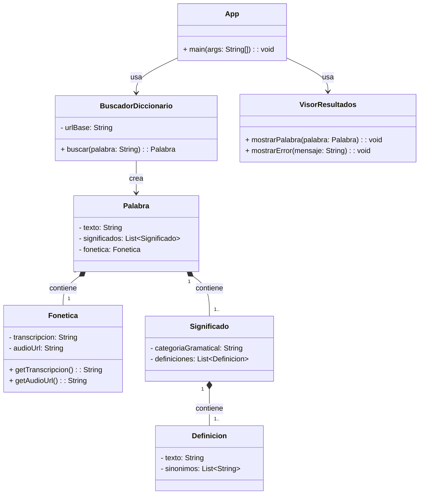

## Proyecto: DictionaryApp

## Descripción
Aplicación que, al introducir el usuario una palabra en inglés, se consulta la Free Dictionary API para 
devolver su significado, pronunciación fonética y sinónimos.
Esta aplicación puede ser útil para estudiantes de idiomas o para cualquier persona que necesite acceso rápido a un diccionario.

## API utilizada
| Campo | Detalle |
|---|---|
| Nombre | Free Dictionary API |
| URL base | https://dictionaryapi.dev/ |
| Documentación | https://api.dictionaryapi.dev/api/v2/entries/en/<word> |
| Autenticación requerida | No |
| Formato de respuesta | JSON |


## Endpoints que voy a usar

| Endpoint | Descripción | Ejemplo de llamada |
|---|---|---|
| /api/v2/entries/en/{word} | Devuelve información completa de una palabra | https://api.dictionaryapi.dev/api/v2/entries/en/hello |


## Funcionalidades principales

Lista las cosas que hará tu aplicación. Empieza por lo más simple.

- [ ] Funcionalidad 1: Conectarse a la API y obtener el JSON de una palabra dada.
- [ ] Funcionalidad 2: Mostrar la definición de la palabra.
- [ ] Funcionalidad 3: Obtener la pronunciación fonética de la palabra.
- [ ] Funcionalidad 4: Mostrar una lista de sinónimos de dicha palabra (si los tiene).


## Clases previstas

| Clase | Responsabilidad |
|---|---|
| `App` | Recibe input del usuario |
| `BuscadorDiccionario` | Llama a la API y devuelve un objeto Palabra |
| `Palabra` | Representa la palabra con su fonética y sus significados |
| `Significado` | Contiene la lista de significados de la palabra y su categoría gramatical |
| `Fonética` | Almacena la transcripción fonética y los enlaces para los audios de pronunciación |
| `Definicion` | Almacena el texto de la definición y los sinónimos |
| `VisorResultado` | Muestra en pantalla todos los resultados obtenidos |

---

## Diagrama de clases UML


## Ejemplo de respuesta JSON de la API

```json

[

  {

    "word": "hello",

    "phonetic": "/həˈloʊ/",

    "phonetics": [

      {

        "text": "/həˈloʊ/",

        "audio": "https://api.dictionaryapi.dev/media/pronunciations/en/hello-us.mp3"

      }

    ],

    "meanings": [

      {

        "partOfSpeech": "exclamation",

        "definitions": [

          {

            "definition": "Used as a greeting or to begin a phone conversation.",

            "synonyms": ["hi", "hey", "greetings"]

          }

        ]

      }

    ]

  }

]

```
 

## Dudas o decisiones pendientes
